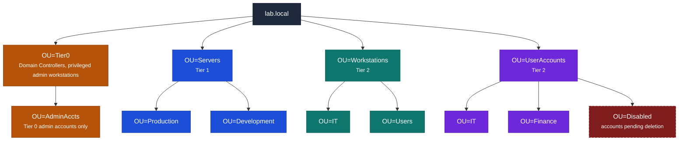

# LAB 3 - Active Directory, GPO & Centralized AAA
{: .no_toc }


<details open markdown="block">
  <summary>Contents</summary>
  {: .text-delta }
1. TOC
{:toc}
</details>

---

## Objectives

- Verify a pre-promoted Active Directory domain controller and understand its design
- Build a multi-tiered OU structure reflecting real-world administrative delegation
- Implement a security baseline GPO and a separate audit policy GPO
- Configure Fine-Grained Password Policy (PSO) for privileged accounts
- Test and verify policy application, account lockout, and audit logging
- Write and test LDAP search filters against the domain, and deploy a minimal FreeRADIUS instance backed by it

---

## Tools Required

- A dedicated VM, `lab03-addc` (Windows Server 2022), for this lab's domain controller - **AD DS is already installed and the forest already promoted** (domain `lab.local`) - you don't need to run `Install-ADDSForest` yourself (see Part 1). Your username is your Net ID, and your password is the one emailed to you at the start of the semester.
- A newly provisioned VM, `lab03-radius01` (Rocky Linux 9), for the FreeRADIUS deployment in Part 8. Your username on it is your Net ID, and your password is the one emailed to you at the start of the semester.
- Group Policy Management Console (GPMC)
- Active Directory Users & Computers (ADUC)
- Active Directory Administrative Center (ADAC)
- `ldapsearch` (from `ldap-utils` / `openldap-clients`)

> **Note on RDP access:** `lab03-addc` is reachable via RDP (Remote Desktop Protocol) on port 3389. Connect using your OS's RDP client (Microsoft Remote Desktop on macOS, the built-in Remote Desktop Connection app on Windows, or Remmina/xfreerdp on Linux), pointing it at the VM's hostname or IP address. Log in with your Net ID and the password emailed to you at the start of the semester. `lab03-radius01` is Rocky Linux, so you'll access it over SSH rather than RDP.

---

## Background

Active Directory is the trust anchor for most enterprise Windows environments - every workstation join, every GPO, and every resource ACL ultimately traces back to a security principal AD issued. A poorly designed OU/tiering model doesn't just create administrative headaches, it creates privilege-escalation paths: a Tier 0 credential exposed to a Tier 2 workstation is a real attack surface, not an inconvenience. This lab treats admin-tiering, password policy, and audit logging as controls with a specific attack each is meant to prevent, and extends the same directory-backed identity model past desktop logon into network-device administration via RADIUS - a router or switch authenticating admins faces the same credential-sprawl risk a workstation does.

---

## Procedure

### Part 1 - Verify the Domain Controller

`lab03-addc`, this lab's own domain controller, ships with AD DS already installed and the forest already promoted - you don't need to run `Install-ADDSForest` yourself. Start by confirming the domain is healthy:
   ```powershell
   Get-ADDomain
   dcdiag /test:replications /test:dns /test:netlogon
   netlogon /query
   ```
   All dcdiag tests must pass.

### Part 2 - OU Structure Design

Design your OU hierarchy to support delegation - each OU represents an administrative boundary. Create the following structure on your domain controller:



### Part 3 - User and Group Creation

Create the following test accounts, representing different privilege tiers:

| Name | SamAccountName | OU/Path | Title | Password | Enabled | Notes |
|---|---|---|---|---|---|---|
| Alice Johnson | ajohnson | OU=IT,OU=UserAccounts,DC=lab,DC=local | IT Analyst | Lab@444Temp! | True | — |
| Bob Martinez | bmartinez | OU=Finance,OU=UserAccounts,DC=lab,DC=local | Financial Analyst | Lab@444Temp! | True | — |
| Carol Kim | ckim | OU=Finance,OU=UserAccounts,DC=lab,DC=local | CFO | Lab@444Temp! | True | — |
| Dave Singh | dsingh | OU=IT,OU=UserAccounts,DC=lab,DC=local | Help Desk | Lab@444Temp! | True | — |
| Eve Novak | enovak | OU=IT,OU=UserAccounts,DC=lab,DC=local | Systems Admin | Lab@444Temp! | True | Standard/daily-use account |
| Eve Novak (Admin) | enovak-adm | OU=AdminAccts,OU=Tier0,DC=lab,DC=local | — | Admin@444Complex#99 | True | Tier 0 privileged account; added to **Domain Admins** group |

Then create two security groups, `GRP-IT-Staff` and `GRP-Finance-Staff`, and add each user to the group matching their department: `ajohnson`, `dsingh`, and `enovak` → `GRP-IT-Staff`; `bmartinez` and `ckim` → `GRP-Finance-Staff`. `enovak-adm` is a Tier 0 credential and shouldn't go in either staff group.

### Part 4 - Security Baseline GPO

Create a **Security-Baseline** GPO linked to the domain root.

Required settings (Computer Configuration → Windows Settings → Security Settings). CIS references below are to the **CIS Microsoft Windows Server 2022 Benchmark v3.0.0** specifically - these item numbers shift between benchmark releases, so always confirm against the version you're actually citing:

| Setting | Value | CIS Reference |
|---|---|---|
| Minimum password length | 14 characters | **1.1.4** (Password Policy) - "Ensure 'Minimum password length' is set to '14 or more character(s)'" |
| Password complexity | Enabled | **1.1.5** (Password Policy) - "Ensure 'Password must meet complexity requirements' is set to 'Enabled'" |
| Password history | 24 passwords remembered | **1.1.1** (Password Policy) - "Ensure 'Enforce password history' is set to '24 or more password(s)'" |
| Max password age | 365 days | **1.1.2** (Password Policy) - "Ensure 'Maximum password age' is set to '365 or fewer days, but not 0'" |
| Account lockout threshold | 5 invalid attempts | **1.2.2** (Account Lockout Policy) - "Ensure 'Account lockout threshold' is set to '5 or fewer invalid logon attempt(s), but not 0'" |
| Account lockout duration | 15 minutes | **1.2.1** (Account Lockout Policy) - "Ensure 'Account lockout duration' is set to '15 or more minute(s)'" |
| Reset lockout counter after | 15 minutes | **1.2.4** (Account Lockout Policy) - "Ensure 'Reset account lockout counter after' is set to '15 or more minute(s)'" |
| Interactive logon: Don't display last signed-in | Enabled | **2.3.7.2** (Interactive Logon) - "Ensure 'Interactive logon: Don't display last signed-in' is set to 'Enabled'" |

### Part 5 - Audit Policy GPO

Create a separate **Audit-Policy** GPO and link it to the domain root. Configure Advanced Audit Policy (not legacy):

| Category | Subcategory | Setting |
|---|---|---|
| Account Logon | Credential Validation | Success, Failure |
| Account Management | User Account Management | Success, Failure |
| Account Management | Security Group Management | Success |
| Logon/Logoff | Logon | Success, Failure |
| Logon/Logoff | Account Lockout | Failure |
| Object Access | File System | Success, Failure |
| Privilege Use | Sensitive Privilege Use | Success, Failure |
| Policy Change | Audit Policy Change | Success |

Apply and verify:
```powershell
gpupdate /force
auditpol /get /category:* | Select-String "Account Logon|Account Management|Logon/Logoff"
```

### Part 6 - Fine-Grained Password Policy (PSO) 

Standard domain password policy applies to all users. Create a stricter PSO for admin accounts:

| Setting | Value | Explanation |
|---|---|---|
| Policy Name | PSO-AdminAccts | Identifier for this Fine-Grained Password Policy (FGPP) object. |
| Precedence | 10 | Determines which PSO wins if a user is subject to more than one. **Lower number = higher priority.** |
| Min Password Length | 20 | Minimum number of characters required in the password. |
| Complexity Enabled | True | Requires the password to mix at least 3 of: uppercase, lowercase, digits, symbols — and disallows the username/parts of it. |
| Password History Count | 24 | Number of previous passwords remembered per user; prevents reusing any of the last 24 passwords. |
| Max Password Age | 90 days | How long a password can be used before AD forces a change. |
| Min Password Age | 1 day | Minimum time that must pass before the password can be changed again — stops someone from cycling through history 24 times in a row to reuse an old password immediately. |
| Lockout Threshold | 3 attempts | Number of failed logon attempts allowed before the account locks out. |
| Lockout Duration | 30 minutes | How long the account stays locked before automatically unlocking (or requires admin unlock if set to 0). |
| Lockout Observation Window | 30 minutes | The rolling time window during which failed attempts are counted toward the lockout threshold. Resets after this period with no failures. |
| Protected From Accidental Deletion | True | Sets `ProtectedFromAccidentalDeletion` on the AD object so it can't be deleted without first removing that protection flag. |
| Applied To (Subject) | enovak-adm | The user/group this PSO is linked to via `Add-ADFineGrainedPasswordPolicySubject`. Only subjects explicitly added receive this policy. |

Verify the PSO is applied by checking the resultant password policy for `enovak-adm` vs. a standard user:

```powershell
Get-ADUserResultantPasswordPolicy -Identity "enovak-adm"
Get-ADUserResultantPasswordPolicy -Identity "bmartinez"
```

### Part 7 - Verification

```powershell
# Confirm GPO application
gpresult /H C:\gpresult.html /F
Start-Process C:\gpresult.html

# Test lockout: attempt 6 failed logins for ajohnson, verify account locks
# (Do NOT do this for enovak-adm - the PSO locks after 3 attempts)
for ($i=1; $i -le 6; $i++) {
  runas /user:ajohnson /noprofile cmd 2>&1
}
Get-ADUser ajohnson -Properties LockedOut | Select-Object SamAccountName, LockedOut

# Unlock:
Unlock-ADAccount -Identity ajohnson

# Verify audit events in Event Viewer
Get-WinEvent -LogName Security | Where-Object {$_.Id -eq 4625} | Select-Object -First 5 | Format-List
```

### Part 8 - Centralized AAA: LDAP Queries & RADIUS

Your domain isn't just used by desktop logons - network infrastructure (routers, switches, VPN concentrators) authenticates administrators against a central directory too, using RADIUS instead of Kerberos/NTLM. This part gives you hands-on time with the query language itself and a minimal RADIUS deployment backed by your domain.

**RADIUS/AAA basics:** RADIUS (RFC 2865) is the protocol most network gear speaks for centralized login instead of Kerberos/NTLM. It's UDP, not TCP - port 1812 for authentication, 1813 for accounting - and the trust relationship isn't between the end user and the RADIUS server directly; it's between the **NAS** (Network Access Server - the router/switch/VPN box the user is actually logging into, played by your own machine running `radtest` in this lab) and the RADIUS server, secured by a shared secret configured on both sides. The exchange is a single request/response: the NAS sends an **Access-Request** with the submitted credentials, and the server answers with **Access-Accept**, **Access-Reject**, or **Access-Challenge** (used for multi-factor flows - out of scope here). Authorization can ride along on an Access-Accept as reply attributes (e.g. which privilege level or VLAN to grant) rather than being a separate exchange, and Accounting is the third A - start/stop/interim records tracking session usage - which this lab doesn't exercise. Everything below only exercises Authentication.

**LDAP filters (write and run against your domain with `ldapsearch`):**

Here's a worked example using a generic setup — with different placeholder values than your lab so it illustrates the pattern without solving your specific exercise:

```
ldapsearch -x -H ldap://dc01.example.com -D "cn=svc-ldapquery,ou=ServiceAccounts,dc=example,dc=com" -W \
  -b "dc=example,dc=com" "(&(objectClass=person)(memberOf=cn=Finance-Admins,ou=Groups,dc=example,dc=com))"
```

| Part of the example | What it maps to |
|---|---|
| `dc01.example.com` | A stand-in LDAP server hostname |
| `cn=svc-ldapquery,ou=ServiceAccounts,dc=example,dc=com` | A stand-in bind DN — a service account with read rights, sitting in a `ServiceAccounts` OU |
| `dc=example,dc=com` | The search base — root of the fictional `example.com` domain |
| `cn=Finance-Admins,ou=Groups,dc=example,dc=com` | A stand-in group DN — shows the group living under a `Groups` OU |

1. Find every user whose `sAMAccountName` belongs to a group called `NetworkAdmins` (create this group first and put 2 test users in it).
2. Find every account that is **disabled**. AD exposes a special LDAP matching-rule OID, `1.2.840.113556.1.4.803`, for testing whether a specific bit is set in a numeric attribute like `userAccountControl` - look up Microsoft's `userAccountControl` flag reference to find which decimal value corresponds to the "account disabled" bit, then build the filter yourself.
3. Find every account whose password has expired or is locked - tie this back to your PSO-protected `enovak-adm` account, and confirm the filter actually returns it after you intentionally lock it.

**FreeRADIUS - local smoke test:**

On `lab03-radius01` (do not run this on the domain controller itself), install and sanity-check FreeRADIUS with a local flat-file user first, before wiring it up to your domain below:

```bash
sudo dnf install -y freeradius freeradius-utils freeradius-ldap
sudo systemctl stop radiusd   # so you can run it in debug mode

echo 'testuser Cleartext-Password := "testpass123"' | sudo tee -a /etc/raddb/users

sudo radiusd -X   # run in foreground debug mode, leave this terminal open
```

In a second terminal, on the same host:

```bash
radtest testuser testpass123 localhost 0 testing123
```

Confirm the debug output shows the Access-Request coming in and an Access-Accept going out.

**Back FreeRADIUS with Active Directory:**

A flat file doesn't scale past one box, and it isn't "centralized" AAA - the whole point is authenticating against the same directory your desktops already trust. FreeRADIUS ships an `ldap` module (`/etc/raddb/mods-available/ldap`, from the `freeradius-ldap` package installed above) that can look a user up in a directory and validate their password against it. To wire it to `lab03-addc`:

- Point the module's `server`/`base_dn` directives at `lab03-addc` and `DC=lab,DC=local`, and give it a bind identity with rights to search the directory (your own domain-admin-equivalent login works fine for lab purposes - a dedicated low-privilege service account would be the production-grade choice).
- Symlink the module from `mods-available/` into `mods-enabled/` so FreeRADIUS actually loads it.
- Reference `ldap` from the `default` site's `authorize {}` section, so a username FreeRADIUS doesn't recognize in the local `users` file falls through to a directory lookup.
- Add an `Auth-Type LDAP { ldap }` block to `authenticate {}` - AD only supports validating a password via a full LDAP simple-bind *as that user*, not a hash comparison, so this has to be an explicit authentication method, not just a lookup.
- Since that bind sends the password in the clear over the LDAP connection, keep the RADIUS client side on PAP (the default `radtest` uses) rather than CHAP/MSCHAP, which AD's LDAP bind can't validate this way.

Restart (or stop/re-run in debug mode) and test against one of your own Part 3 domain accounts - not `testuser`, which only exists in the local file and proves nothing about the LDAP path:

```bash
sudo systemctl restart radiusd   # or Ctrl-C the debug session and run `sudo radiusd -X` again

radtest ajohnson 'Lab@444Temp!' localhost 0 testing123    # expect Access-Accept
radtest ajohnson 'wrong-password' localhost 0 testing123  # expect Access-Reject - proves it's really checking AD, not accepting anything
```

If the first `radtest` doesn't return Access-Accept, check the debug window for an LDAP bind error before troubleshooting anything else - a bad bind DN/password or an unreachable `server` value is the most common cause.

**Gate a real login behind RADIUS:**

`radtest` only ever *simulates* a NAS talking to your RADIUS server - it never actually logs anyone into anything. To see this for real, make one SSH login on `lab03-radius01` itself require RADIUS.

> **Safety first:** you're about to change how SSH authenticates on this box. Keep your current SSH session open while you test - don't log out until you've confirmed the change works, so a mistake can't lock you out. Scope the change to a single, dedicated account rather than your own login (see below) so there's no way this affects your own access or the TA account used for grading.

1. Install FreeRADIUS's PAM client - `pam_radius` comes from EPEL, not the base repos, so enable that first (`sudo dnf install -y epel-release && sudo dnf install -y pam_radius`) - and point its config (`/etc/pam_radius.conf`) at your own FreeRADIUS server (`127.0.0.1`, using the shared secret you're already using with `radtest`).
2. Create a new local Linux user named `ajohnson` with **no local password** (a disabled/locked password, so there's nothing for it to fall back to) - this account exists purely so RADIUS has something to authenticate.
3. In `/etc/pam.d/sshd`, add the RADIUS PAM module - but guard it with a `pam_succeed_if` check so it only ever applies **when the login is for `ajohnson`**. This is the important part: an unscoped change here would route every SSH login on the box (including your own, and the TA account graded logins use) through RADIUS, and any mistake in your RADIUS config would lock everyone out, not just this one test account.
4. Confirm `sshd_config` has PAM-based authentication actually enabled (`UsePAM yes`, plus `KbdInteractiveAuthentication yes` - or `ChallengeResponseAuthentication yes` on older OpenSSH versions).

Verify with a real login - not `testuser`, and not from the domain controller (SSH from your own machine, or from a second session into `lab03-radius01`):

```bash
ssh ajohnson@lab03-radius01
# password prompt: enter Lab@444Temp! (ajohnson's real AD password) - should succeed

ssh ajohnson@lab03-radius01
# password prompt: enter anything wrong - should be rejected
```

If this works, you've just logged into a Linux machine using nothing but an Active Directory credential, validated end to end through RADIUS and LDAP - the same mechanism a real switch or VPN concentrator relies on.

---

## Grading

| Item | Points |
|------|--------|
| OU structure design and verification (Parts 1-2) | 15 |
| User and group creation (Part 3) | 10 |
| Security Baseline GPO (Part 4) | 12 |
| Audit Policy GPO (Part 5) | 10 |
| Fine-Grained Password Policy / PSO (Part 6) | 10 |
| Verification - lockout test, audit events (Part 7) | 13 |
| LDAP filters and query outputs (Part 8) | 15 |
| FreeRADIUS local deployment and debug analysis (Part 8) | 15 |
| FreeRADIUS authentication backed by Active Directory via LDAP (Part 8) | 15 |
| A real RADIUS-gated SSH login, scoped safely to one account (Part 8) | 15 |
| **Total** | **130** |

[← Back to Labs]({{ site.baseurl }}/labs/)
