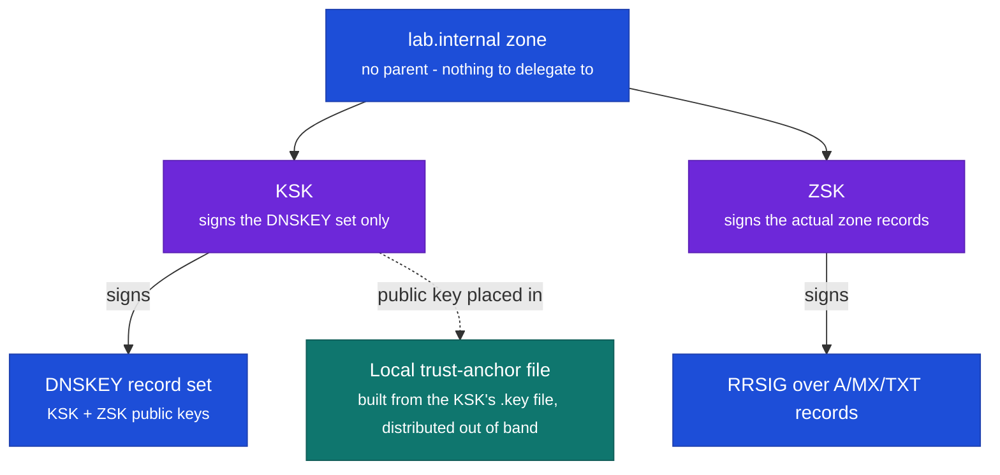
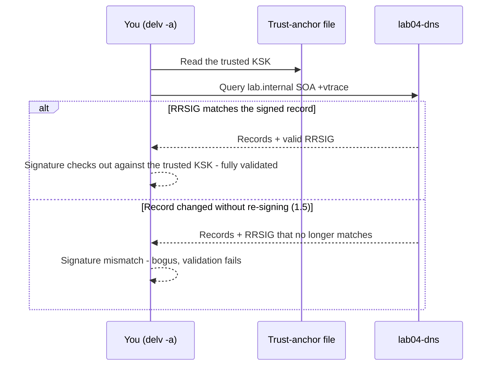
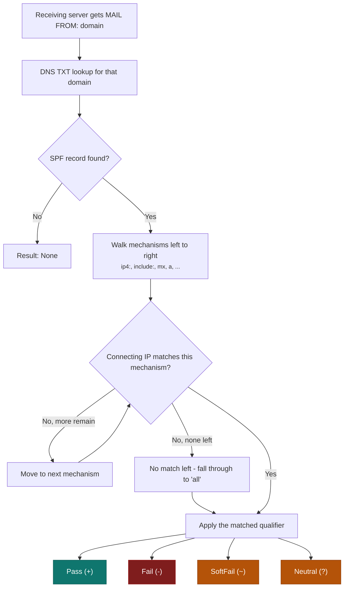
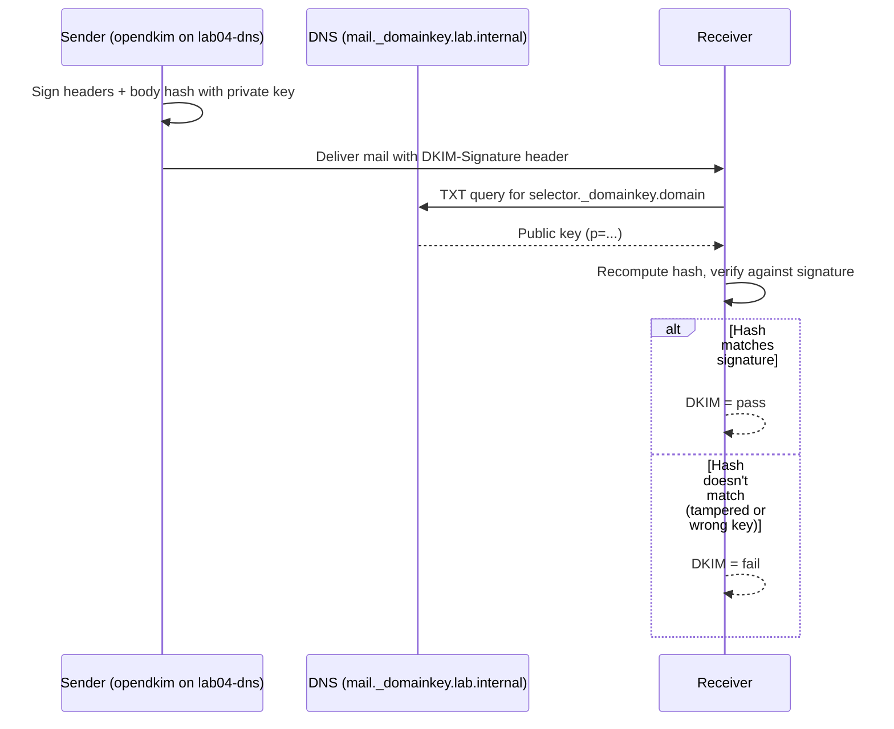
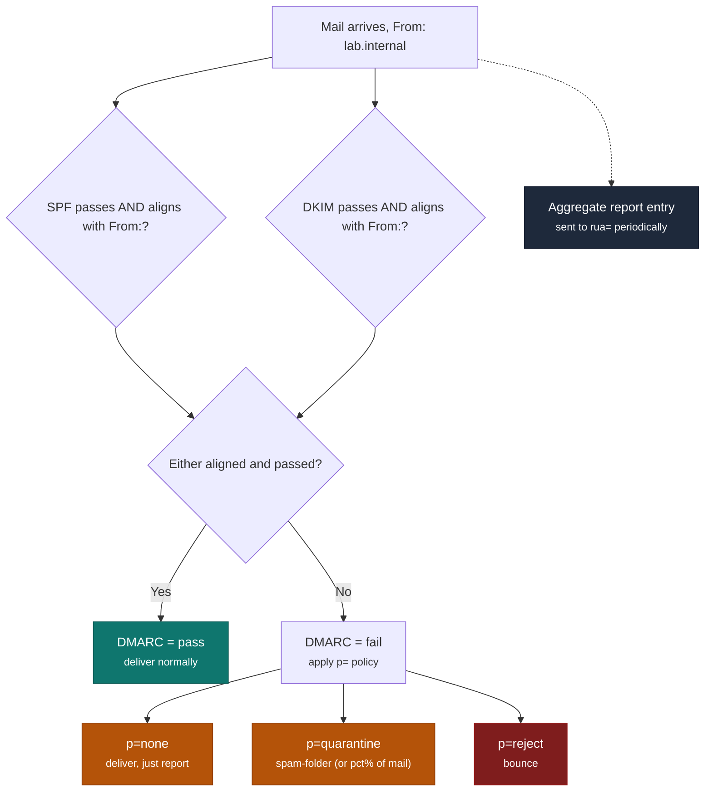
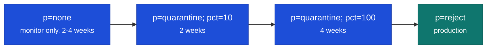

# IT LAB 4 - DNSSEC & Email Security Configuration
{: .no_toc }

<details open markdown="block">
  <summary>Contents</summary>
  {: .text-delta }
1. TOC
{:toc}
</details>

---

## Objectives

- Sign a DNS zone with DNSSEC using both KSK and ZSK keys, including computing a DS record and configuring a local trust anchor
- Configure and validate SPF, DKIM, and DMARC for an email domain
- Implement DMARC reporting and interpret aggregate report data
- Analyze DNSSEC chain of trust validation and diagnose common DNSSEC failures

---

## Tools Required

- Your instructor has provisioned a dedicated Rocky Linux 9 VM for this lab, `lab04-dns` (2 vCPU, 4GB RAM). Deploy it yourself in Discord using `/deploy` and selecting `it-lab-04`; your username is your Net ID and your password is the one emailed to you at the start of the semester, same as every other lab. It's reachable at `172.19.x.15` (`x` = your subnet's third octet, same addressing scheme as Lab 3's VMs).
- `lab04-dns` comes pre-provisioned with BIND and firewalld already installed and running, chrony and OpenDKIM already installed (EPEL already enabled too), plus a working `lab.internal` zone. OpenDKIM is only used in this lab to generate a key pair (`opendkim-genkey`) - you never enable or start the daemon itself, since this lab only builds the DNS-publishing side of DKIM.

---

## Background

DNSSEC (DNS Security Extensions) adds cryptographic signatures to DNS responses, preventing cache poisoning and man-in-the-middle attacks. The chain of trust flows from the root zone (signed by ICANN) through TLD registrars to individual zone operators. A break anywhere in the chain causes SERVFAIL for validating resolvers.

SPF, DKIM, and DMARC form the email authentication triad: SPF specifies authorized senders, DKIM signs message content, DMARC tells receivers what to do with failures and requests reports. Together they prevent domain spoofing, phishing, and unauthorized bulk mail.

This lab uses `lab.internal` is on `lab04-dns`, this lab's own dedicated BIND server: the DNSSEC signing and email records you create are real, served, and independently verifiable - not simulated. What's different from a public domain is how trust gets established. A public domain gets a parent zone (a registrar's TLD) to vouch for its signing key via a DS record; `lab.internal` has no parent at all - `.internal` is a reserved pseudo-TLD (like `.local` or `.test`) that will never exist in the public DNS, for anyone, ever.
---

## Procedure

### Part 1 - DNSSEC Zone Signing

Throughout this part, `lab.internal` is the zone you're working with - it's already running on `lab04-dns`; there's no domain name to substitute in.

#### Chain of trust and KSK vs ZSK

On a public domain, DNSSEC's chain of trust works by having each parent zone vouch for its child's signing key, all the way up to the root. `lab.internal` has no parent - `.internal` is a reserved pseudo-TLD that will never be delegated by anyone, for anyone. So instead of a chain, this lab uses the model real organizations actually use for internal-only DNSSEC zones: a **local trust anchor**. Whoever needs to validate `lab.internal` - you, your TA, the grading script - is handed the zone's KSK directly, out of band (via a file, in 1.4), rather than discovering it by walking a chain from the root. Once you have that key, validation works exactly the same way: check the RRSIG on every record against a key you already trust, and reject anything that doesn't match. Break that link - a key that doesn't match, a signature that doesn't verify - and validation fails closed, the same as it would on a public domain.

You'll generate two separate keys in 1.1 because they play different roles in that model:

- The **ZSK** (Zone Signing Key) signs the actual zone data - the RRSIGs over your A, MX, and TXT records. It's used constantly (every time the zone is re-signed), so it's kept shorter for cheaper, faster signing, and rotated frequently (every ~3 months, per 1.6) since it's a lower-blast-radius key to replace.
- The **KSK** (Key Signing Key) signs only the DNSKEY record set - in effect, it vouches for the ZSK. On a public domain, the parent's DS record points at the KSK specifically, so rotating it means publishing a new DS record upstream - a slower, more disruptive operation. Here, the equivalent cost is that rotating the KSK means redistributing a new trust-anchor file to everyone validating this zone (1.6) - same shape of problem, just manual instead of automatic - which is still why it's longer and rotated only yearly.



`lab04-dns` already has `lab.internal` running and authoritative for itself - there's nothing to register and nothing to delegate. Go straight to generating keys.

**1.1 Generate KSK and ZSK**

`dnssec-keygen` produces both halves of each key pair: a `.key` file (the public half - safe to publish in the zone) and a `.private` file (the private half, used only for signing and never leaving this host). You're generating two independent pairs here, one ZSK and one KSK, matching the roles described above.

```bash
sudo mkdir -p /var/named/keys && cd /var/named/keys

# Zone Signing Key (ZSK) - shorter, rotated more frequently
sudo dnssec-keygen -a RSASHA256 -b 1024 -n ZONE lab.internal

# Key Signing Key (KSK) - longer, rotated rarely
sudo dnssec-keygen -a RSASHA256 -b 2048 -n ZONE -f KSK lab.internal

sudo chown -R named:named /var/named/keys
ls -la /var/named/keys/
```

Record the key IDs (the numbers in the filenames, e.g., `Klab.internal.+008+12345`) - you'll need both to reference the right files in 1.3, when you `$INCLUDE` the public keys into your zone and sign it with the matching private ones, and the KSK's ID again in 1.4.

**1.2 Point named at the signed zone**

Rocky ships BIND's configuration as a single `/etc/named.conf`. `lab04-dns` already has a `lab.internal` zone block pre-seeded in it (the same zone from Lab 2's own baseline, included so this lab doesn't depend on your Lab 2 VM) - find that block and make it match the one below, rather than looking for a separate `named.conf.local`. (Compare Lab 2, Part 3.1, if you want a refresher on the zone-block syntax.)

```
zone "lab.internal" {
    type master;
    file "/var/named/lab.internal.zone.signed";
    notify no;
};
```

This is a **static, pre-signed zone**: `file` points at the signed output that `dnssec-signzone` will produce in 1.3, and BIND serves exactly what's in that file - it does no signing of its own. Notice what's *absent*: `key-directory`, `auto-dnssec`, and `inline-signing`. Those directives make BIND sign the zone itself and keep its own separate signed copy, which would defeat this lab: BIND would quietly re-sign any change you make to the signed file, so the validation-failure demo in 1.5 could never fail. The trade-off of static signing is that you do the signing work yourself - every zone edit needs a re-sign (see the end of 1.3).

Don't reload named yet - the signed file doesn't exist until 1.3.

**1.3 Sign the zone**

Signing happens in two steps: first the zone file needs to actually contain your public keys (so anyone who transfers the zone gets the DNSKEY records too), then `dnssec-signzone` walks every record in the zone and generates an RRSIG for it using your private keys. Replace `XXXXX` and `YYYYY` below with the real key IDs you recorded in 1.1 (ZSK and KSK respectively):

```bash
# Add $INCLUDE directives for both keys to the zone file
cd /var/named
sudo tee -a lab.internal.zone <<'EOF'
$INCLUDE /var/named/keys/Klab.internal.+008+XXXXX.key   ; ZSK public key
$INCLUDE /var/named/keys/Klab.internal.+008+YYYYY.key   ; KSK public key
EOF

# Sign the zone (manual approach for learning)
sudo dnssec-signzone -A -3 $(head -c 1000 /dev/random | sha1sum | cut -c1-16) \
    -N INCREMENT -o lab.internal -t \
    /var/named/lab.internal.zone \
    /var/named/keys/Klab.internal.+008+XXXXX.private \
    /var/named/keys/Klab.internal.+008+YYYYY.private
sudo restorecon -Rv /var/named
```

The `-3` flag adds NSEC3 (hashed denial-of-existence, which makes it much harder to enumerate your whole zone by querying nonexistent names one at a time) with a random salt; `-N INCREMENT` bumps the serial in the signed output automatically so you don't have to hand-edit it every time you re-sign. The command produces a brand-new file, `lab.internal.zone.signed`, leaving your original unsigned zone untouched - that's the file the `file` directive from 1.2 points at. Check it, then load it:

```bash
sudo named-checkzone lab.internal /var/named/lab.internal.zone.signed
sudo systemctl reload named
```

**Re-signing is now part of every zone edit.** BIND serves `lab.internal.zone.signed` exactly as written and never looks at `lab.internal.zone` again. So each time you change the unsigned zone in Parts 2-4, you must re-run the `dnssec-signzone` command above (not the `$INCLUDE` step - that's one-time) and then `sudo rndc reload lab.internal`, or the change is never served. Signatures produced by `dnssec-signzone` also expire (30 days by default), after which validation fails until you re-sign; see `man dnssec-signzone` (`-e`) if you need them to last longer.

**1.4 Verify DNSSEC signatures and configure a local trust anchor**

Four separate checks, each confirming a different piece of what you just built: that the zone publishes its keys, that it actually announces DNSSEC support, that individual records carry real signatures, and that you can derive the same DS-record hash a real parent delegation would use. The `+dnssec` flag on `dig` just requests DNSSEC records in the response (it sets the DO bit) - it doesn't validate anything itself, which is why the `delv` step further down is a separate, stronger check.

```bash
# Publish check: the DNSKEY records (KSK and ZSK)
dig @127.0.0.1 lab.internal DNSKEY +multiline

# Query with DNSSEC DO bit
dig @127.0.0.1 lab.internal SOA +dnssec +multiline

# Verify RRSIG records exist
dig @127.0.0.1 www.lab.internal A +dnssec | grep RRSIG

# Compute the DS record hash - this is the exact hash a real parent zone would need
dig @127.0.0.1 lab.internal DNSKEY | dnssec-dsfromkey -f - lab.internal
```

`lab.internal` has no parent zone to hand that DS hash to - there's nothing at the other end to delegate to. What takes its place is a **local trust anchor** - the thing you hand directly to whoever needs to validate this zone, in place of a chain from the root. `delv` doesn't accept a raw `.key` file for this; it reads a trust-anchor file written in `named.conf` syntax, so you wrap your **KSK's** public key in a `trust-anchors` block. Replace `ZZZZZ` with your KSK's key ID from 1.1 (not the ZSK):

```bash
grep -v '^;' /var/named/keys/Klab.internal.+008+ZZZZZ.key | awk '
{
  for (i = 1; i <= NF; i++) if ($i == "DNSKEY") {
    k = ""; for (j = i + 4; j <= NF; j++) k = k $j
    printf "trust-anchors {\n    lab.internal. static-key %s %s %s \"%s\";\n};\n", $(i+1), $(i+2), $(i+3), k
  }
}' | sudo tee /var/named/keys/lab.internal.trust-anchor
```

The output should look like this. The flags value `257` confirms you used the KSK; `256` means you used the ZSK's ID by mistake, so redo it with the other key:

```
trust-anchors {
    lab.internal. static-key 257 3 8 "AwEAAb...long base64...";
};
```

Now walk the validation yourself with `delv`, BIND's own DNSSEC-aware lookup tool - it performs the same check a validating resolver does and prints every step along the way instead of just handing back the final answer. `delv` doesn't automatically know about a private zone's key the way it does for the real public root - it needs to be told explicitly with `-a`, pointing at the trust-anchor file you just created. It also assumes trust anchors belong to the root zone unless told otherwise, so without `+root=lab.internal` it silently ignores your anchor and stops with `No trusted keys were loaded`:

```bash
delv @127.0.0.1 +root=lab.internal lab.internal SOA +vtrace -a /var/named/keys/lab.internal.trust-anchor
```

A successful run ends with `; fully validated` above the SOA and RRSIG records. In the trace, look for the KSK verifying the DNSKEY set and then the ZSK verifying the SOA - that's the trust anchor → KSK → ZSK → record path.

You'll still need to be on the class VPN to reach `lab04-dns` at all (same as any lab VM) - but that's just ordinary lab-network access, nothing DNSSEC-specific about it anymore. There's no "public resolver can't complete the chain" case to worry about here, because there's no chain to walk in the first place.

Document the DNSKEY records (KSK and ZSK), the RRSIG for the A record, the DS record hash from the fourth `dig` command, and the `delv` output showing a fully validated result.

Here's what that validation actually looks like end to end, and what changes when a record's been tampered with (which is exactly what you're about to simulate in 1.5):



**1.5 Simulate a DNSSEC validation failure**

This is the failure mode DNSSEC exists to catch: a record's data changes without its signature being regenerated - exactly what an attacker tampering with a response in transit would produce. Because BIND is serving your pre-signed file as-is (1.2), you can reproduce that by editing the *signed* zone file directly, rather than editing the unsigned source and re-signing it. The old RRSIG stays in place next to data it no longer matches.

First confirm the signed file is plain text (it should be - that's `dnssec-signzone`'s default output), then tamper with the `www` A record:

```bash
file /var/named/lab.internal.zone.signed

# Change the www A record from 10.0.0.10 to 10.0.0.99 in the signed file only
sudo sed -i 's/10\.0\.0\.10\b/10.0.0.99/' /var/named/lab.internal.zone.signed
sudo rndc reload lab.internal
```

Query it two ways:

```bash
dig @127.0.0.1 www.lab.internal A +dnssec
delv @127.0.0.1 +root=lab.internal www.lab.internal A +vtrace -a /var/named/keys/lab.internal.trust-anchor
```

`dig` hands back the tampered `10.0.0.99` next to the original RRSIG with no complaint at all, because `dig` doesn't validate - that's the point. `delv` does validate, and it should refuse the answer: expect a `resolution failed` result caused by an RRSIG that fails to verify, with the `+vtrace` output showing the ZSK's signature check failing instead of succeeding (the exact wording varies by BIND version). A validating resolver querying through this server would surface the same problem to its client as **SERVFAIL** rather than hand back data it can't trust. Document the error you see.

Now restore the zone. Re-running the signing command from 1.3 regenerates every signature from your unsigned source, which wipes out the tampering. Then reload and confirm you're validating again:

```bash
# re-run the dnssec-signzone command from 1.3, then:
sudo rndc reload lab.internal
delv @127.0.0.1 +root=lab.internal www.lab.internal A -a /var/named/keys/lab.internal.trust-anchor
```

You should see `; fully validated` and the original `10.0.0.10` again.

**1.6 Key rollover planning**

Rotation cadence follows directly from the KSK/ZSK distinction above: ZSKs should be rotated every 3 months, KSKs every year, since a KSK rollover also means redistributing a new trust-anchor file to everyone validating this zone (here: rebuilding `/var/named/keys/lab.internal.trust-anchor` from the new KSK's `.key` file with the 1.4 command) - the manual version of the same problem a real DS-record update solves automatically at a registrar. The trickiest part of any rollover is that anything relying on the old key needs to pick up the new one before the old one goes away - swap keys instantly and anything still holding the old key will fail to validate signatures made with the new one. The ZSK rollover procedure below avoids that by publishing the new key before it's used for signing (the KSK's private key stays in every `dnssec-signzone` run throughout, since it signs the DNSKEY set):

1. Generate new ZSK
2. Pre-publish the new ZSK: add its public key to the zone (a second `$INCLUDE`) and re-sign with the *old* ZSK still doing the signing - the DNSKEY set now carries both keys, so resolvers have a chance to pick up the new one
3. Wait one TTL period (for caches to pick up the new key) - by now, nothing should still be relying on only the old key
4. Re-sign the zone with the new ZSK only
5. Remove the old ZSK (its `$INCLUDE`) and re-sign after another TTL period, once no cached signature anywhere still references it

---

### Part 2 - SPF Configuration

SPF (Sender Policy Framework) publishes a list of authorized mail servers for your domain.

A receiving mail server doesn't just trust the visible `From:` header - it validates SPF against the *envelope-from* address (the SMTP `MAIL FROM`, which can differ from what's displayed). It looks up that domain's SPF TXT record, walks the mechanism list left to right, and applies the qualifier of the first mechanism the connecting IP matches (or falls through to the trailing `all` if nothing else does). The record you'll publish in 2.1 ends in `-all` - a hard fail, rejecting anything not sent from `10.0.0.20` outright - which is stricter than the placeholder `~all` (softfail) record `lab04-dns` shipped with.



**2.1 Create SPF record**

For `lab.internal`, create a TXT record authorizing only your mail server (10.0.0.20). Reading the mechanisms left to right, the same order a receiving server would evaluate them in: `v=spf1` marks this as an SPF record, `ip4:10.0.0.20` is the one mechanism that should ever match, and `-all` is the catch-all for everything else - a hard fail, since nothing besides your own mail server should legitimately send as `lab.internal`. `/var/named/lab.internal.zone` already contains the placeholder SPF record (`v=spf1 mx ~all`). A domain must publish exactly one SPF record, and two make SPF evaluation fail with a permanent error. 
**2.2 Test SPF lookup**

Confirm the record is live and syntactically what you expect before moving on - a typo here (a missing quote, a mistyped IP) fails silently until a real mail server tries to evaluate it against actual traffic:


---

### Part 3 - DKIM Configuration

DKIM (DomainKeys Identified Mail) signs outgoing messages so receivers can verify they haven't been tampered with.

DKIM works because signing is asymmetric: the private key lives only on the sending server (never published anywhere, never leaves `lab04-dns`) and signs a hash of specific headers plus the message body, producing the `DKIM-Signature` header you'll see attached to outgoing mail. The matching *public* key is what you publish in DNS, at `mail._domainkey.lab.internal`, in 3.2. A receiving server pulls the selector and domain straight out of that header, fetches the public key over DNS, recomputes the same hash, and checks it against the signature - proving both that the message wasn't altered in transit and that whoever sent it holds the domain's private key.



This lab only builds the left half of that diagram - the key pair and the DNS record a receiver would look up. You won't configure or start the OpenDKIM daemon itself, so nothing here actually signs outgoing mail; what you're demonstrating is that the public half of a real key pair is correctly published where a receiver would expect to find it.

**3.1 Generate DKIM keys**


```bash
sudo dnf install -y opendkim opendkim-tools

# Generate a 2048-bit RSA key pair
sudo mkdir -p /etc/opendkim/keys/lab.internal
sudo opendkim-genkey -b 2048 -d lab.internal -D /etc/opendkim/keys/lab.internal \
    -s mail -v

# Set permissions
sudo chown -R opendkim:opendkim /etc/opendkim
sudo chmod 700 /etc/opendkim/keys/lab.internal
sudo chmod 600 /etc/opendkim/keys/lab.internal/mail.private

cat /etc/opendkim/keys/lab.internal/mail.txt
```

**3.2 Publish DKIM DNS record**

The `mail.txt` file `opendkim-genkey` just wrote already contains the exact TXT record to publish - copy it rather than retyping it, since the `p=` value is long and a single dropped character silently breaks verification. (It will look split across several quoted strings - that's normal for a long TXT record.) Add it to `/var/named/lab.internal.zone` at the selector name (`mail._domainkey`). The `p=` value is the base64-encoded public key - the half of the pair that's safe to hand out, since only the matching private key (still sitting in `/etc/opendkim/keys/lab.internal/mail.private`, never published) could ever produce a signature that verifies against it. 

**3.3 Verify the DKIM record**

Confirm the record is reachable the way a real receiving server would fetch.

---

### Part 4 - DMARC Configuration and Reporting

DMARC (Domain-based Message Authentication, Reporting and Conformance) ties SPF and DKIM together with a policy and reporting mechanism.

DMARC doesn't grade SPF and DKIM independently - it checks whether the domain each one actually validated *aligns* with the visible `From:` header domain. SPF alignment means the envelope-from domain (what SPF checked) matches the `From:` domain; DKIM alignment means the signature's `d=` domain matches it too. Critically, DMARC passes if **either** one aligns and passes - not both - which is what keeps a DMARC-protected domain from breaking the moment a mailing list or forwarder disturbs SPF alone. Whatever the result, receivers append it to an aggregate report and periodically mail that report to the `rua=` address (4.1) - that's how you'd see real-world sending patterns and failures before ever tightening `p=` past `none`.



**4.1 Create DMARC record**

Every DMARC record lives at a fixed location, `_dmarc.lab.internal`, so receivers always know where to look without any additional discovery step. This one starts at the safest possible stage: `p=none` takes no enforcement action at all - nothing gets quarantined or rejected because of it - so you can watch real evaluation results come in via the `rua=`/`ruf=` reporting addresses before ever risking legitimate mail. `adkim=r`/`aspf=r` set *relaxed* alignment (a subdomain of the From: domain still counts as aligned) rather than *strict*, and `fo=1` asks for a forensic report whenever either mechanism fails, not only when both do.

Publish a TXT record at `_dmarc.lab.internal` that sets the DMARC policy to "none," meaning receiving servers take no action on messages that fail authentication and simply report on them. The same monitor-only policy applies to all subdomains. Aggregate reports are sent to dmarc-reports@lab.internal, and forensic (failure) reports go to dmarc-forensics@lab.internal. Both DKIM and SPF alignment are set to relaxed, so a subdomain of lab.internal still counts as aligned with the organizational domain. The policy covers 100 percent of messages, and forensic reports are requested whenever any authentication check fails, whether SPF or DKIM, rather than only when both fail.


**4.2 DMARC policy progression**

The recommended DMARC deployment stages:

| Stage | Policy | Purpose | Duration |
|-------|---------|---------|---------|
| 1 | `p=none` | Monitoring - collect data without blocking | 2-4 weeks |
| 2 | `p=quarantine; pct=10` | Quarantine 10% of failing mail | 2 weeks |
| 3 | `p=quarantine; pct=100` | Quarantine all failing mail | 4 weeks |
| 4 | `p=reject` | Reject all failing mail | Production state |

The same progression, visually:



---


## Grading

| Item | Points |
|------|--------|
| DNSSEC signed zone with validation + failure demo | 33 |
| SPF configuration | 17 |
| DKIM key generation and DNS record | 28 |
| DMARC configuration | 22 |
| **Total** | **100** |


[← Back to Labs]({{ site.baseurl }}/labs/)