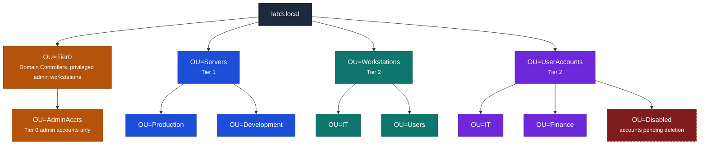
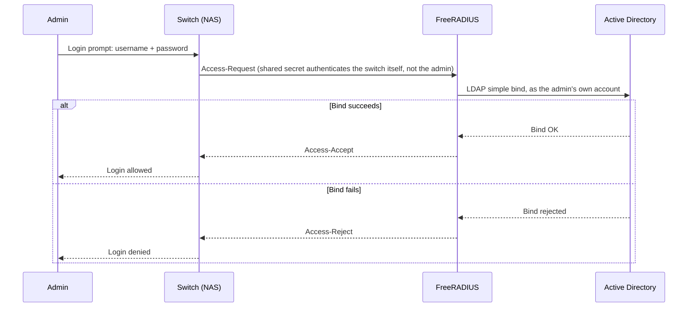

# LAB 3 - Active Directory, GPO & Centralized AAA
{: .no_toc }


<details open markdown="block">
  <summary>Contents</summary>
  {: .text-delta }
1. TOC
{:toc}
</details>

---

## Objectives

- Verify a pre-promoted Active Directory domain controller and understand its design
- Build a multi-tiered OU structure reflecting real-world administrative delegation
- Implement a security baseline GPO and a separate audit policy GPO
- Configure Fine-Grained Password Policy (PSO) for privileged accounts
- Test and verify policy application, account lockout, and audit logging
- Deploy a minimal FreeRADIUS instance that authenticates against the domain, scoped to a specific admin group

---

## Tools Required

- A dedicated VM, `lab03-addc` (Windows Server 2022), for this lab's domain controller - **AD DS is already installed and the forest already promoted** (domain `lab3.local`) - you don't need to run `Install-ADDSForest` yourself (see Part 1). Your username is your Net ID, and your password is the one emailed to you at the start of the semester.
- A newly provisioned VM, `lab03-radius01` (Rocky Linux 9), for the FreeRADIUS deployment in Part 8. Your username on it is your Net ID, and your password is the one emailed to you at the start of the semester.
- Group Policy Management Console (GPMC)
- Active Directory Users & Computers (ADUC)
- Active Directory Administrative Center (ADAC)
- `ldapsearch` (from `ldap-utils` / `openldap-clients`)

> **Note on RDP access:** `lab03-addc` is reachable via RDP, at `172.19.x.14`, where `x` is the third octet of your own nested subnet (the same one your `pve1`/`pve2`/`pve3` VMs live on). Connect using your OS's RDP client (Microsoft Remote Desktop on macOS, the built-in Remote Desktop Connection app on Windows, or Remmina/xfreerdp on Linux). Log in with your Net ID and the password emailed to you at the start of the semester. You might see a black screen for a minute or two the first time you connect while it sets up your profile.
>
> `lab03-radius01` is Rocky Linux, so you'll access it over SSH rather than RDP, at `172.19.x.13`.

---

## Background

Active Directory is the trust anchor for most enterprise Windows environments - every workstation join, every GPO, and every resource ACL ultimately traces back to a security principal AD issued. A poorly designed OU/tiering model doesn't just create administrative headaches, it creates privilege-escalation paths: a Tier 0 credential exposed to a Tier 2 workstation is a real attack surface, not an inconvenience. This lab treats admin-tiering, password policy, and audit logging as controls with a specific attack each is meant to prevent, and extends the same directory-backed identity model past desktop logon into network-device administration via RADIUS - a router or switch authenticating admins faces the same credential-sprawl risk a workstation does.

---

## Procedure

### Part 1 - Verify the Domain Controller

`lab03-addc`, this lab's own domain controller, ships with AD DS already installed and the forest already promoted - you don't need to run `Install-ADDSForest` yourself. Start by confirming the domain is healthy:
   ```powershell
   Get-ADDomain
   dcdiag /test:replications /test:dns /test:netlogons
   nltest /query
   ```
   All dcdiag tests must pass.

### Part 2 - OU Structure Design

Design your OU hierarchy to support delegation - each OU represents an administrative boundary. Create the following structure on your domain controller:



### Part 3 - User and Group Creation

Create the following test accounts, representing different privilege tiers:

| Name | SamAccountName | OU/Path | Title | Password | Enabled | Notes |
|---|---|---|---|---|---|---|
| Alice Johnson | ajohnson | OU=IT,OU=UserAccounts,DC=lab3,DC=local | IT Analyst | Lab@444Temp! | True | — |
| Bob Martinez | bmartinez | OU=Finance,OU=UserAccounts,DC=lab3,DC=local | Financial Analyst | Lab@444Temp! | True | — |
| Carol Kim | ckim | OU=Finance,OU=UserAccounts,DC=lab3,DC=local | CFO | Lab@444Temp! | True | — |
| Dave Singh | dsingh | OU=IT,OU=UserAccounts,DC=lab3,DC=local | Help Desk | Lab@444Temp! | True | — |
| Eve Novak | enovak | OU=IT,OU=UserAccounts,DC=lab3,DC=local | Systems Admin | Lab@444Temp! | True | Standard/daily-use account |
| Eve Novak (Admin) | enovak-adm | OU=AdminAccts,OU=Tier0,DC=lab3,DC=local | — | Admin@444Complex#99 | True | Tier 0 privileged account; added to **Domain Admins** group |

Then create three security groups - `GRP-IT-Staff`, `GRP-Finance-Staff`, and `NetworkAdmins` (this last one comes back in Part 8 to actually restrict who FreeRADIUS lets authenticate) - and add each user to the group(s) matching their role: `ajohnson`, `dsingh`, and `enovak` → `GRP-IT-Staff`; `bmartinez` and `ckim` → `GRP-Finance-Staff`; `ajohnson` and `dsingh` also go in `NetworkAdmins`. `enovak-adm` is a Tier 0 credential and shouldn't go in any of these.

### Part 4 - Security Baseline GPO

Create a **Security-Baseline** GPO linked to the domain root.

Required settings (Computer Configuration → Windows Settings → Security Settings). CIS references below are to the **CIS Microsoft Windows Server 2022 Benchmark v3.0.0** specifically - these item numbers shift between benchmark releases, so always confirm against the version you're actually citing:

| Setting | Value | CIS Reference |
|---|---|---|
| Minimum password length | 14 characters | **1.1.4** (Password Policy) - "Ensure 'Minimum password length' is set to '14 or more character(s)'" |
| Password complexity | Enabled | **1.1.5** (Password Policy) - "Ensure 'Password must meet complexity requirements' is set to 'Enabled'" |
| Password history | 24 passwords remembered | **1.1.1** (Password Policy) - "Ensure 'Enforce password history' is set to '24 or more password(s)'" |
| Max password age | 365 days | **1.1.2** (Password Policy) - "Ensure 'Maximum password age' is set to '365 or fewer days, but not 0'" |
| Account lockout threshold | 5 invalid attempts | **1.2.2** (Account Lockout Policy) - "Ensure 'Account lockout threshold' is set to '5 or fewer invalid logon attempt(s), but not 0'" |
| Account lockout duration | 15 minutes | **1.2.1** (Account Lockout Policy) - "Ensure 'Account lockout duration' is set to '15 or more minute(s)'" |
| Reset lockout counter after | 15 minutes | **1.2.4** (Account Lockout Policy) - "Ensure 'Reset account lockout counter after' is set to '15 or more minute(s)'" |
| Interactive logon: Don't display last signed-in | Enabled | **2.3.7.2** (Interactive Logon) - "Ensure 'Interactive logon: Don't display last signed-in' is set to 'Enabled'" |

### Part 5 - Audit Policy GPO

Create a separate **Audit-Policy** GPO and link it to the domain root. Configure Advanced Audit Policy (not legacy):

| Category | Subcategory | Setting |
|---|---|---|
| Account Logon | Credential Validation | Success, Failure |
| Account Management | User Account Management | Success, Failure |
| Account Management | Security Group Management | Success |
| Logon/Logoff | Logon | Success, Failure |
| Logon/Logoff | Account Lockout | Failure |
| Object Access | File System | Success, Failure |
| Privilege Use | Sensitive Privilege Use | Success, Failure |
| Policy Change | Audit Policy Change | Success |

Apply and verify:
```powershell
gpupdate /force
auditpol /get /category:* | Select-String "Account Logon|Account Management|Logon/Logoff"
```

### Part 6 - Fine-Grained Password Policy (PSO) 

Standard domain password policy applies to all users. Create a stricter PSO for admin accounts:

| Setting | Value | Explanation |
|---|---|---|
| Policy Name | PSO-AdminAccts | Identifier for this Fine-Grained Password Policy (FGPP) object. |
| Precedence | 10 | Determines which PSO wins if a user is subject to more than one. **Lower number = higher priority.** |
| Min Password Length | 20 | Minimum number of characters required in the password. |
| Complexity Enabled | True | Requires the password to mix at least 3 of: uppercase, lowercase, digits, symbols — and disallows the username/parts of it. |
| Password History Count | 24 | Number of previous passwords remembered per user; prevents reusing any of the last 24 passwords. |
| Max Password Age | 90 days | How long a password can be used before AD forces a change. |
| Min Password Age | 1 day | Minimum time that must pass before the password can be changed again — stops someone from cycling through history 24 times in a row to reuse an old password immediately. |
| Lockout Threshold | 3 attempts | Number of failed logon attempts allowed before the account locks out. |
| Lockout Duration | 30 minutes | How long the account stays locked before automatically unlocking (or requires admin unlock if set to 0). |
| Lockout Observation Window | 30 minutes | The rolling time window during which failed attempts are counted toward the lockout threshold. Resets after this period with no failures. |
| Protected From Accidental Deletion | True | Sets `ProtectedFromAccidentalDeletion` on the AD object so it can't be deleted without first removing that protection flag. |
| Applied To (Subject) | enovak-adm | The user/group this PSO is linked to via `Add-ADFineGrainedPasswordPolicySubject`. Only subjects explicitly added receive this policy. |

Verify the PSO is applied by checking the resultant password policy for `enovak-adm` vs. a standard user:

```powershell
Get-ADUserResultantPasswordPolicy -Identity "enovak-adm"
Get-ADUserResultantPasswordPolicy -Identity "bmartinez"
```

### Part 7 - Verification

```powershell
# Confirm GPO application
gpresult /H C:\gpresult.html /F
Start-Process C:\gpresult.html

# Test lockout: attempt 6 failed logins for ajohnson, verify account locks
# (Do NOT do this for enovak-adm - the PSO locks after 3 attempts)
for ($i=1; $i -le 6; $i++) {
  runas /user:ajohnson /noprofile cmd 2>&1
}
Get-ADUser ajohnson -Properties LockedOut | Select-Object SamAccountName, LockedOut

# Unlock:
Unlock-ADAccount -Identity ajohnson

# Verify audit events in Event Viewer
Get-WinEvent -LogName Security | Where-Object {$_.Id -eq 4625} | Select-Object -First 5 | Format-List
```

### Part 8 - Centralized AAA via RADIUS

Your domain isn't just used by desktop logons - network infrastructure (routers, switches, VPN concentrators) authenticates administrators against a central directory too, using RADIUS instead of Kerberos/NTLM. This part gives you hands-on time with a minimal RADIUS deployment that authenticates directly against your domain.

#### RADIUS/AAA Basics

RADIUS (RFC 2865) is the protocol most network gear speaks for centralized login instead of Kerberos/NTLM. It's UDP, not TCP - port 1812 for authentication, 1813 for accounting - and the trust relationship isn't between the end user and the RADIUS server directly; it's between the **NAS** (Network Access Server - the router/switch/VPN box the user is actually logging into, played by your own machine running `radtest` in this lab) and the RADIUS server, secured by a shared secret configured on both sides. The exchange is a single request/response: the NAS sends an **Access-Request** with the submitted credentials, and the server answers with **Access-Accept**, **Access-Reject**, or **Access-Challenge** (used for multi-factor flows - out of scope here). Authorization can ride along on an Access-Accept as reply attributes (e.g. which privilege level or VLAN to grant) rather than being a separate exchange, and Accounting is the third A - start/stop/interim records tracking session usage - which this lab doesn't exercise. Everything below only exercises Authentication.

Here's the full chain for a network admin logging into a switch, end to end - the switch never talks to AD directly, and the admin's password only ever leaves their own terminal once:




#### FreeRADIUS Backed by Active Directory

On `lab03-radius01` (do not run this on the domain controller itself), install FreeRADIUS and wire it directly to your domain - a real deployment authenticates against the same directory your desktops already trust, not a local flat file:

```bash
sudo dnf install -y freeradius freeradius-utils freeradius-ldap
```

FreeRADIUS ships an `ldap` module (`/etc/raddb/mods-available/ldap`, from the `freeradius-ldap` package you just installed) that can look a user up in a directory and validate their password against it. To wire it to the DC (use the IP of `172.19.x.14`, not the hostname, since you don't have any custom DNS set up. Though if you want to set up DNS instead of just pointing to an IP address, be my guest):

- Radius needs an account with which to "bind" (or connect) to the server, so first you need to create a new account. Call it whatever you want, just keep track of its password and username for later. This should be separate from any existing account with permissions, since the only permissions it needs is a valid login to the DC. This is the account whose credentials end up sitting in a plaintext config file on `lab03-radius01`, so it should never be your own login or any other Domain Admin account - scope the blast radius of that config file to "can search/bind," nothing more.

- Point the module's `server`/`base_dn` directives at `172.19.x.14` and `DC=lab3,DC=local`, and give it that new account as its bind identity. Here's an example config for the four components you need to fill out:

  ```
  server = 'dc01.example.com'
  identity = 'svc-radius-bind@example.com'
  password = 'ExamplePassw0rd!'
  base_dn = 'DC=example,DC=com'
  ```

- Symlink the module from `mods-available/` into `mods-enabled/` so FreeRADIUS actually loads it.
- Now that you have a functional "mod" for LDAP, there are edits that need to be made to the default "site" for Radius (`/etc/raddb/sites-available/default`):
  - By default, `ldap` is referenced `authorize {}` section, so a submitted username gets looked up via a directory lookup. Currently, that looks like `-ldap`. Find that line, verify its existence, and figure out if it needs to be changed and why.
  - Uncomment the default `Auth-Type LDAP { ldap }` block in `authenticate {}` - AD only supports validating a password via a full LDAP simple-bind *as that user*, not a hash comparison, so this has to be an explicit authentication method, not just a lookup.
<!-- - Since that bind sends the password in the clear over the LDAP connection, keep the RADIUS client side on PAP (the default `radtest` uses) rather than CHAP/MSCHAP, which AD's LDAP bind can't validate this way. -->
- Any domain account working isn't realistic - a real deployment gating switch/router logins would only let actual network admins in. Restrict who FreeRADIUS will even authenticate to members of your `NetworkAdmins` group (the one you built back in Part 3). The module's `user { filter = ... }` block already has a second, commented-out version of the lookup filter built for exactly this - built around AD's `LDAP_MATCHING_RULE_IN_CHAIN` OID rather than a plain `memberOf=` clause, which matters because it walks *nested* group membership too, not just direct members. Swap to that version and point its group reference at `NetworkAdmins` instead of the placeholder group name it ships with.

With that in place, start it in debug mode:

```bash
sudo radiusd -X   # run in foreground debug mode, leave this terminal open
```

Read the startup output before moving on - this command may not come up cleanly on the first try. That's expected: a couple of FreeRADIUS's default-enabled pieces need a bit of one-time setup on a fresh install before the daemon will fully start, and diagnosing *why* a service won't come up from its own startup log is a real skill, not a detour from the lab. Don't move on until `radiusd -X` reaches a steady "Ready to process requests" state with no errors above it.

In a second terminal, on the same host, test against your own Part 3 domain accounts:

```bash
radtest ajohnson 'Lab@444Temp!' localhost 0 testing123    # expect Access-Accept - ajohnson is in NetworkAdmins
radtest ajohnson 'wrong-password' localhost 0 testing123  # expect Access-Reject - proves it's really checking AD, not accepting anything
radtest bmartinez 'Lab@444Temp!' localhost 0 testing123   # expect Access-Reject - bmartinez's password is correct, but bmartinez isn't in NetworkAdmins
```

If the first `radtest` doesn't return Access-Accept, check the debug window for an LDAP bind error before troubleshooting anything else - a bad bind DN/password or an unreachable `server` value is the most common cause. If the third one unexpectedly succeeds, your filter is still matching on password alone and isn't actually enforcing group membership.

---

## Grading

| Item | Points |
|------|--------|
| OU structure design and verification (Parts 1-2) | 20 |
| User and group creation (Part 3) | 18 |
| Security Baseline GPO (Part 4) | 16 |
| Audit Policy GPO (Part 5) | 14 |
| Fine-Grained Password Policy / PSO (Part 6) | 14 |
| Verification - lockout test, audit events (Part 7) | 18 |
| **Total** | **100** |
| FreeRADIUS installed and authenticating against Active Directory via LDAP, scoped to NetworkAdmins (Part 8) | **27 (Extra Credit)** |

[← Back to Labs]({{ site.baseurl }}/labs/)
